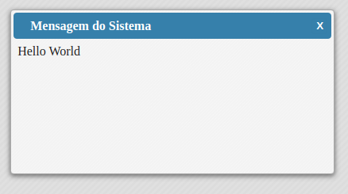
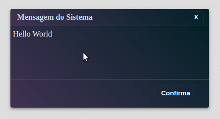
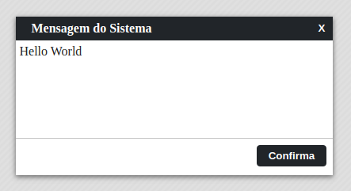

# xModal v1.0

O xModal é uma janela de diálogo personalizada inspirada inicialmente no showModal do Delphi. 
Ele usa nativamente javascript em sua construção.

[Instalação](#instalação)<br>
[Importando](#importando)<br>
[Modo de Uso](#modo-de-uso)<br>
[Temas](#temas)<br>
[Parâmetro Create](#parâmetro-create)<br>
[Métodos](#métodos)<br>
[Desenvolvedores](#desenvolvedores)<br>

## Instalação

Clone o repositório em um diretório local.

```sh
    git clone https://github.com/dffrancisco/xModal
```

## Importando

<h3>Forma 1</h3>

Em seu html declare o css:
```html
    <link rel="stylesheet" href="./xModal.css">
```

Para usar o xModal você deve chamá-lo em seu arquivo .js através de import.
```javascript
    import xModal from './xModal';
```

<h3>Forma 2</h3>

Em seu html declare o arquivo js.

```html
    <link rel="stylesheet" href="./xModal.css">
    <script src="./xModal.js"></script>
```

É necessário comentar/descomentar as linhas no arquivo xModal.js:

```javascript
    export default (function() { //comentar essa linha
    let xModal = (function() { // descomentar essa linha
```

## Modo de Uso

É necessário uma div no seu html com um id
```html
    <!DOCTYPE html>
    <html lang="pt-BR">
    <head>
        <title>Mofo v2.0</title>
    </head>
    <body>
        <div id="minhaDiv">Hello World!</div>
        <script src="index.js" type="module"></script>
    </body>
    </html>
```
No javascript iremos instanciar o objeto da seguinte forma:

<h3>Create</h3>

```javascript
    const minhaDiv = new xModal.create({
        el: '#minhaDiv'
    })

    //// Abre o modal
    minhaDiv.open();
```

## Temas

<table>
    <tr>
        <th>xModal-blue</th>
        <th>xModal-opacity</th>
        <th>xModal-dark</th>
        <th>xModal-dark-square</th>
    </tr>
    <tr>
        <td></td>
        <td></td>
        <td></td>
        <td></td>
    </tr>
</table>

## Parâmetro Create

Create é responsável por instanciar o xModal. Recebe um objeto como parâmetro que pode ter as seguintes propriedades passadas:

<table>
    <tr>
        <th align="center">Propriedade</th>
        <th align="center">Descrição</th>
        <th align="center">Tipo</th>
        <th align="center">Default</th>
    </tr>
    <tr>
        <td>el</td>
        <td>Id do elemento (div) onde será instanciado o xModal. <strong>(Obrigatório)</strong></td>
        <td align="center">String</td>
        <td align="center"></td>
    </tr>
    <tr>
        <td>title</td>
        <td>Título da janela.</td>
        <td align="center">String</td>
        <td align="center">Mensagem do Sistema</td>
    </tr>
    <tr>
        <td>width</td>
        <td>Largura da janela.</td>
        <td align="center">Numeric</td>
        <td align="center">75%</td>
    </tr>
    <tr>
        <td>height</td>
        <td>Altura da janela.</td>
        <td align="center">Numeric</td>
        <td align="center">75%</td>
    </tr>
    <tr>
        <td>resize</td>
        <td>Propriedade que informa se poderá redimensionar a janela.</td>
        <td align="center">Boolean</td>
        <td align="center">False</td>
    </tr>
    <tr>
        <td>theme</td>
        <td>Tema que será utilizado na janela, temas disponíveis:<br>
        xModal-blue, xModal-opacity, xModal-dark </td>
        <td align="center">String</td>
        <td align="center">xModal-blue</td>
    </tr>
    <tr>
        <td>left</td>
        <td>Define a posição (left) onde a janela será aberta.</td>
        <td align="center">Numeric</td>
        <td align="center"></td>
    </tr>
    <tr>
        <td>top</td>
        <td>Define a posição (top) onde a janela será aberta.</td>
        <td align="center">Numeric</td>
        <td align="center"></td>
    </tr>
    <tr>
        <td>fullScreen</td>
        <td>Caso queira que a janela abre em tela cheia, informe true.</td>
        <td align="center">Boolean</td>
        <td align="center">False</td>
    </tr>
    <tr>
        <td>closeBtn</td>
        <td>Mostra o botão fechar no canto superior direito da janela</td>
        <td align="center">Boolean</td>
        <td align="center">True</td>
    </tr>
    <tr>
        <td>esc</td>
        <td>Determina se o botão esc pode fechar o modal.</td>
        <td align="center">Boolean</td>
        <td align="center">True</td>
    </tr>
    <tr>
        <td>modal</td>
        <td>Limita o acesso apenas a janela aberta.</td>
        <td align="center">Boolean</td>
        <td align="center">True</td>
    </tr>
    <tr>
        <td>titleDisplay</td>
        <td>Possibilita a visualização ou não da barra de título da janela.</td>
        <td align="center">Boolean</td>
        <td align="center">True</td>
    </tr>
    <tr>
        <td>onCreate</td>
        <td>Função que será executada ao instanciar o objeto, só executa uma vez.</td>
        <td align="center">Function</td>
        <td align="center"></td>
    </tr>
    <tr>
        <td>onOpen</td>
        <td>Função que será executada sempre que abrir a janela.</td>
        <td align="center">Function</td>
        <td align="center"></td>
    </tr>
    <tr>
        <td>onClose</td>
        <td>Função que será executa sempre que fechar a janela.</td>
        <td align="center">Function</td>
        <td align="center"></td>
    </tr>
    <tr>
        <td>onKeyDown</td>
        <td>Permite a janela escutar pressionamento de teclas e executar uma função para as teclas determinadas.<pre>
onKeyDown:{
    13: (e)=>{console.log('enter pressionado')},    
    'ctrl+13': (e)=>{console.log('ctrl+enter pressionado')}
    'ctrl+shift+alt+13': (e)=>{
        console.log('ctrl+shift+alt+13 pressionado')}
    }</pre></td>
        <td align="center">Object</td>
        <td align="center"></td>
    </tr>
    <tr>
        <td>buttons</td>
        <td>Botões que irão aparecer na janela.<pre>
buttons:{
    btn1:  // identificador do botão
    {
        html: 'Confirma', //texto do botão
        class: 'left',    // class do botão (opcional)
        click: (e)=>{
            // função que será executada ao 
            clicar no botão
        }   
    },
    btn2:{ // pode ser adicionado n botões }
}
        </pre></td>
        <td align="center">Object</td>
        <td align="center"></td>
    </tr>
    <tr>
        <td>execAfter</td>
        <td>Invoca o clique do botão após determinado tempo.
        <pre>execAfter{
            time: 10,           // tempo em segundos
            btn: 'confirma'     // nome do btn
        }</pre>
        </td>
        <td align="center">Object</td>
        <td align="center"></td>
    </tr>
</table>

## Métodos
    
Esses métodos serão utilizados na variável instanciada. Ex.:<br>
```javascript
    minhaDiv.close();
```

<table>
    <tr>
        <th>Método</th>
        <th align="center">Parâmetro</th>
        <th>Descrição</th>
    <tr>
    <tr>
        <td>btnFocus</td>
        <td align="center">nameBtn: String</td>
        <td>Coloca o foco no botão passado por parâmetro.</td>
    </tr>
    <tr>
        <td>btnDisable</td>
        <td align="center">nameBtn: String</td>
        <td>Desabilita o botão passado por parâmetro.</td>
    </tr>
    <tr>
        <td>btnEnable</td>
        <td align="center">nameBtn: String</td>
        <td>Habilita o botão passado por parâmetro.</td>
    </tr>
    <tr>
        <td>btnClick</td>
        <td align="center">nameBtn: String</td>
        <td>Clica no botão passado por parâmetro.</td>
    </tr>
    <tr>
        <td>setTitle</td>
        <td align="center">title: String</td>
        <td>Altera o título da janela.</td>
    </tr>
    <tr>
        <td>open</td>
        <td align="center">nenhum</td>
        <td>Abre a janela de diálogo.</td>
    </tr>
    <tr>
        <td>close</td>
        <td align="center">nenhum</td>
        <td>Fecha a janela de diálogo.</td>
    </tr>
    <tr>
        <td>destroy</td>
        <td align="center">nenhum</td>
        <td>Destrói a instância criada.</td>
    </tr>
</table>

## Desenvolvedores

[Francisco Alves](https://github.com/dffrancisco)<br>
[Guilherme Trindade](https://github.com/guigagb)